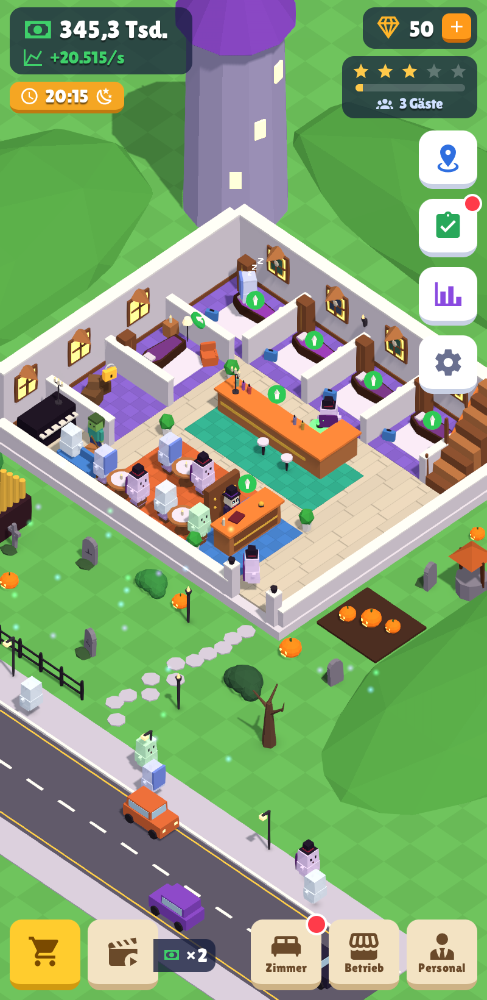
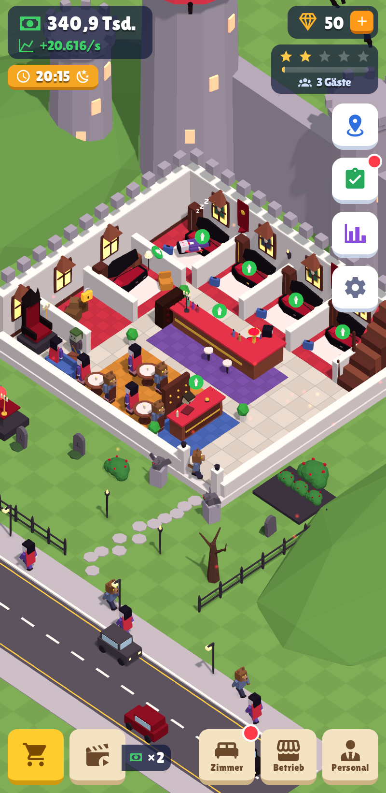
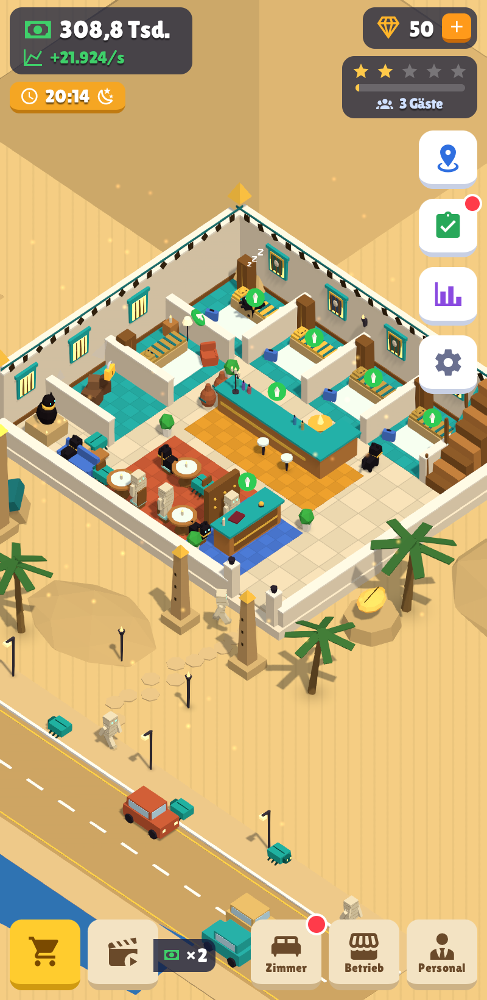
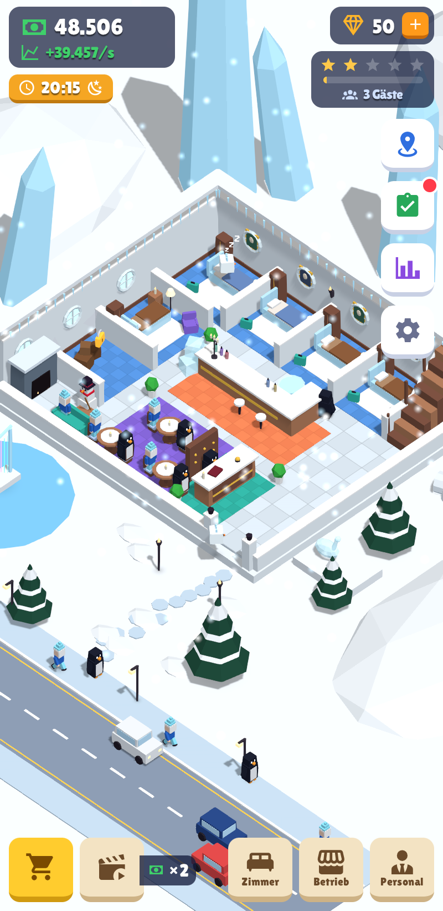
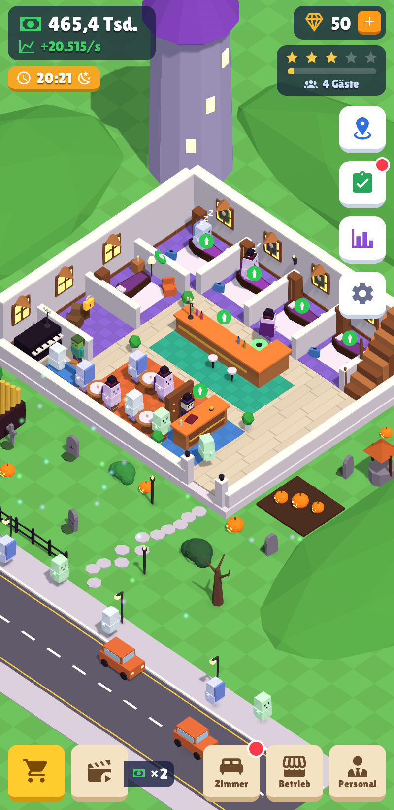

# 👻 Spukhotel

<p>
  
  
  
  
  
</p>

Ein 3D-Idle-Game über Hotels für Monster. Du startest mit dem **Spukhotel Nachtruh** für Gespenster
und baust ein Imperium auf: **Burg Dracula** (Vampire, Werwölfe, Nosferatu), das **Pharaonengrab**
(Mumien, Anubis, Pharao) und den **Yeti-Eispalast** (Yetis, Frostelfen, Eiskönigin).
Gäste checken ein, schlafen, trinken an der Bar, zahlen und geben Trinkgeld – Personal
automatisiert die Arbeit, und nicht besuchte Hotels verdienen nebenbei weiter.

Look & Bedienung orientieren sich an den Codigames-Tycoons (Idle Supermarket, Theme Park,
Prison Empire): Lambert-Flat-Shading mit klarer Drei-Ton-Sonne, helle dicke Schnittwände,
eine kräftige Bodenfarbe pro Zone (Zimmer, Bar, Lounge, Rezeption), voll eingerichtete Räume,
Straße mit Verkehr und Passanten, blockige Figuren mit Lauf-Animation,
Geld + Einkommen/Sekunde oben links, Video-×2-Button, weiße Upgrade-Karten mit ×1/×10/MAX,
Meilensteinen und Mitarbeiter-Zeile, grüne Upgrade-Pfeile direkt in der Welt.
Alle Grafiken sind eigene 3D-Modelle, direkt im Code gebaut – keine Bilddateien, keine gekauften Assets.

## Starten

```bash
npm install
npx expo start          # QR-Code mit Expo Go scannen (Android/iOS)
npx expo start --web    # im Browser spielen
```

## Spielablauf

| Was | Wie |
| --- | --- |
| Gast mit **!** an der Rezeption | antippen → Check-in |
| Gast mit **Becher** an der Bar | antippen → Drink servieren |
| **Goldmünze** über einem Gast | antippen → Trinkgeld (×3) |
| **Schleim/Flecken** im Zimmer | antippen → putzen (erst dann ist das Zimmer wieder frei) |
| Kamera | ziehen = umsehen, zwei Finger / Mausrad = zoomen |
| **Zimmer / Bar / Rezeption antippen** | Upgrade-Karte öffnet sich (×1 / ×10 / MAX, Meilensteine, Mitarbeiter) |
| **Grüner Pfeil** über einer Station | Upgrade ist bezahlbar |
| **Video ×2** (unten links) | Werbevideo → 4 Min doppelte Einnahmen (bis 4 h stapelbar) – aktuell Platzhalter, siehe `game/ads.js` |
| **Zimmer** | Zimmer öffnen und ausbauen (mehr Geld, schönere Einrichtung) |
| **Betrieb** | Bar & Rezeption ausbauen, **Attraktionen** im Garten bauen (Trinkgeld-, Zimmer- und Tempo-Boni) |
| **Personal** | einstellen (Automatik) und schulen (bis Stufe 5, schneller) |
| **Aufträge** | wechselnde Ziele, bringen Kristalle |
| **Hotels** | neue Hotels kaufen (3 ★ im vorherigen nötig) und zwischen ihnen reisen |
| **Shop** (💎 oben) | Geisterstunde ×2, Schatztruhe (1 h Einnahmen sofort) |
| **Einstellungen** (⚙) | Grafikqualität Niedrig / Mittel / Hoch / Ultra, Spielstand zurücksetzen |

Jedes Hotel hat 6 Gasttypen, die mit den Hotelsternen freigeschaltet werden, eigenes Personal,
eigene Betten, eine eigene Bar und drei eigene Attraktionen. Offline-Einnahmen gibt es bis 8 h.

## Projektstruktur

```
app/index.js                Spielbildschirm: 3D-Szene + HUD + Kamera-Gesten
game/
  hotels.js                 die 4 Hotels: Farben, Gäste, Personal, Attraktionen
  config.js                 Balancing-Formeln und Grundriss/Wegpunkte
  store.js                  Wirtschaft aller Hotels (speichert automatisch, migriert alte Spielstände)
  sim.js                    Echtzeit-Simulation von Gästen, Personal, Trinkgeld
  quests.js                 Aufträge
  quality.js                Grafik-Stufen
components/scene/           three.js / react-three-fiber
  HotelScene.js             Canvas, Licht, Kamera, Qualitätsstufen
  Hotel.js                  Gebäude, Zimmer, Rezeption, Bar, Lounge (für alle Hotels)
  exteriors/*.js            je Hotel: Außenwelt, Deko, Bar-/Lounge-Stück, Attraktionen
  Characters.js             alle Gäste und Angestellten
  Beds.js, Props.js         Betten und Möbel
  textures.js               prozedurale Texturen
  Sky.js, Particles.js      Himmel, Mond, Nordlicht, Partikel, Nebel
  PostFX.js                 Bloom, Tone-Mapping, Vignette, SMAA (Ultra)
components/hud/             2D-Oberfläche (Leisten, Menüs, Popups)
```

Neues Hotel hinzufügen: Eintrag in `game/hotels.js` + Datei in `components/scene/exteriors/`
+ ggf. neue Modelle in `Characters.js`.

## Technik

Expo SDK 54 · React Native 0.81 · three.js 0.180 · @react-three/fiber 9 (nativ über `expo-gl`) ·
postprocessing 6 · Zustand 5 · Reanimated 4 · expo-linear-gradient.
Standard-Grafik: Web „Ultra“, Handy „Mittel“ – in den Einstellungen umstellbar.
