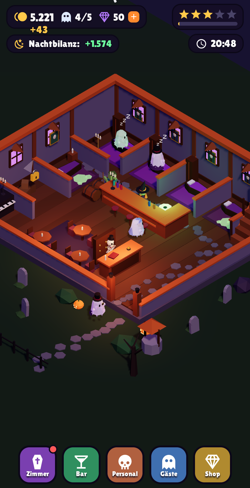

# 👻 Spukhotel



Ein gemütliches 3D-Idle-Game: Du führst ein Hotel **für Geister**. Gespenster schweben vom
Friedhof herein, checken an der Rezeption ein, schlummern in ihrer Gruft, gönnen sich an der
Nebeltee-Bar einen Drink und zahlen dafür. Später stellst du Personal ein
(Skelett, Zombie, Hexe), das die Arbeit übernimmt – dein Hotel verdient dann auch, während du weg bist.

Alle Grafiken sind eigene Low-Poly-3D-Modelle, direkt im Code aus three.js-Grundformen gebaut
(keine Bilddateien, keine gekauften Assets).

## Starten

```bash
npm install
npx expo start          # QR-Code mit Expo Go scannen (Android/iOS)
npx expo start --web    # im Browser spielen
```

## Spielablauf

| Was | Wie |
| --- | --- |
| Geist mit **!** an der Rezeption | antippen → Check-in |
| Geist mit **Becher** an der Bar | antippen → Drink servieren |
| **Grüner Schleim** in einer Gruft | antippen → putzen (erst dann ist die Gruft wieder frei) |
| Kamera | ziehen = umsehen, zwei Finger / Mausrad = zoomen |
| **Zimmer** | neue Grüfte öffnen, bestehende ausbauen (mehr Münzen, schönere Einrichtung) |
| **Bar** | Nebeltee-Bar eröffnen/ausbauen, Rezeption ausbauen (schnellere Gäste) |
| **Personal** | Skelett = Auto-Check-in · Zombie = Auto-Putzen · Hexe = Auto-Bar |
| **Gäste** | Hotelsterne schalten neue, zahlungskräftigere Geister frei (bis zur Geisterkönigin ×12) |
| **Shop** | Kristalle gegen „Geisterstunde ×2“ tauschen, Spielstand zurücksetzen |

Offline-Einnahmen (bis 8 h) gibt es beim nächsten Start, eine Nacht dauert 10 Minuten (20:00–06:00).

## Projektstruktur

```
app/
  _layout.js            Schrift laden, Splash-Screen
  index.js              Spielbildschirm: 3D-Szene + HUD + Kamera-Gesten
game/
  config.js             Balancing, Geistertypen, Grundriss/Wegpunkte
  store.js              Wirtschaft (Zustand + AsyncStorage, speichert automatisch)
  sim.js                Echtzeit-Simulation der Gäste & des Personals
  camera.js             Kamera-Position/Zoom für Gesten
components/scene/       three.js / react-three-fiber
  HotelScene.js         Canvas, Licht, isometrische Kamera
  Hotel.js              Gebäude, Grüfte, Bar, Rezeption, Friedhofsgarten
  Characters.js         Geister (6 Typen), Skelett, Hexe, Zombie
  Actors.js             bewegte Figuren, Sprechblasen, Münz-Effekte
  primitives.js         Low-Poly-Bausteine + Material-Cache
components/hud/         2D-Oberfläche (Top-Leiste, Menüs, Popups)
```

Neue Inhalte hinzufügen:
- **Geistertyp** → Eintrag in `GUEST_TYPES` (`game/config.js`) + Aussehen in `Ghost` (`Characters.js`)
- **Balancing** → Preise/Kosten-Formeln in `game/config.js`
- **Deko** → neue Low-Poly-Objekte in `Hotel.js` mit `Box`, `Cyl`, `Cone`, `Ball`, `Rock`

## Technik

Expo SDK 54 · React Native 0.81 · three.js 0.180 · @react-three/fiber 9 (nativ über `expo-gl`) ·
Zustand 5 · Reanimated 4. Schatten sind nur im Web aktiv (Performance auf Handys).
