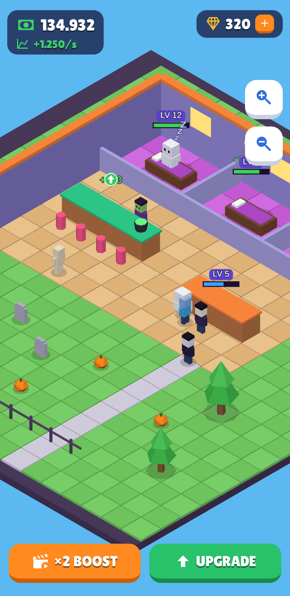
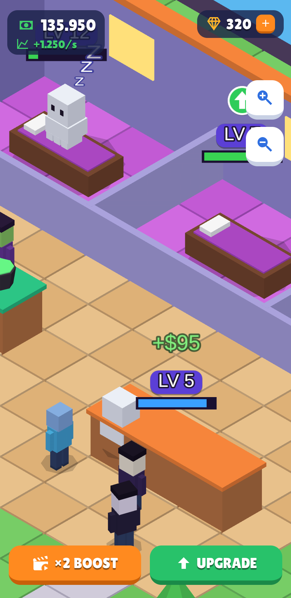
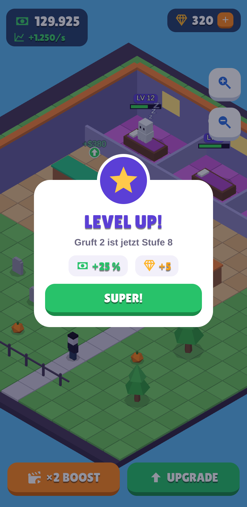

# Engine-Vorgaben „Hyper-Casual Low-Poly 3D“ – Beispiel-Rendering

Live-Demo (Entwickler-Route, nicht im Spiel verlinkt): `/spec` · Parameter: `?size=10.5&x=6.6&z=7.4&popup=1`

| Übersicht | World-Space-UI (Zoom) | Screen-Space-Popup |
| --- | --- | --- |
|  |  |  |

## Umsetzung der Vorgaben

| Vorgabe | Umsetzung in `components/spec/` |
| --- | --- |
| **Orthografische Projektion**, keine Perspektive | `<Canvas orthographic>`; Frustum wird pro Frame aus der Ortho-Size gesetzt (`OrthoRig`) |
| **Isometrisch**: X −30…−45°, Y 45° | `camera.rotation.order = 'YXZ'`, Pitch −35,264° (echtes Iso), Yaw 45° – in `rig.pitchDeg/yawDeg` einstellbar |
| **Zoom = Orthographic Size**, nicht Distanz | `rig.size` = halbe sichtbare Höhe → `left/right/top/bottom`; Kameradistanz bleibt konstant |
| **Panning auf X/Z** | Ziehen verschiebt nur `rig.x / rig.z` (bildschirmausgerichtet umgerechnet) |
| **Low-Poly, Flat Shading** | Box/Zylinder/Kegel mit 5–8 Segmenten, Ikosaeder Detail 0 |
| **Keine PBR, keine UV-Texturen** | nur `MeshLambertMaterial({ flatShading })` und unbeleuchtetes `MeshBasicMaterial`, reine Farben |
| **Keine teuren Berechnungen** | keine Shadow-Maps, kein Post-Processing, kein Tone-Mapping; Kontaktschatten als halbtransparente Scheiben |
| **Striktes Grid** | `cell(gx, gz)` setzt jedes Objekt auf Rasterzellen (1×1); Boden = eine `InstancedMesh` mit Farbe pro Zelle, Rasterlinien entstehen durch die Fugen |
| **Screen-Space-UI** | `SpecHud.js`: abgerundete Panels, fette serifenlose Schrift, grüne/orange Buttons mit weißer Schrift |
| **World-Space-UI mit Billboard** | `worldUi.js › Billboard` kopiert jede Frame die Kamera-Rotation; Level-Badges, Fortschrittsbalken, Zzz, Upgrade-Pfeile, alle `depthTest: false` |
| **Aufsteigende Geld-Texte** | `MoneyPopups`: Instanz-Pool, Spawn als World-Space-Objekt, Tween nach oben (easeOutCubic), Pop-in (easeOutBack), Ausblenden |
| **Rudimentäre 3D-Animation** | Figuren: reine Translation entlang Rasterpfaden + Wippen; Zzz/Pfeile: Translation/Skalierung |
| **UI-Feedback per Code-Tween** | Buttons: Squash + Feder-Overshoot; Popup: `Easing.elastic`; Stern: `Easing.back`; Geldzähler zählt per Ease-out hoch und „ploppt“ |

## Abweichungen im aktuellen Spiel (Migrationsliste)

| Bereich | Spiel heute | Laut Vorgabe |
| --- | --- | --- |
| Materialien | `MeshStandardMaterial` (+ Rim-/Physical-Shader) | `MeshLambertMaterial` / `MeshBasicMaterial` – zentral in `primitives.js › M()` umstellbar |
| Schatten | Shadow-Maps ab „Hoch“ | nur Kontaktschatten (sind schon vorhanden) |
| Post-Processing | Bloom + SMAA auf „Ultra“ | entfällt |
| Boden/Gelände | Farbtexturen (`clean*`) | farbige Rasterzellen (InstancedMesh) |
| Layout | freie Koordinaten (z. B. 1,5 / 3,9) | alle Stationen, Wege und Deko auf Rasterzellen |
| Kamera | Diagonal-Position + `camera.zoom` | explizites Rig mit Pitch/Yaw und Ortho-Size (fachlich gleichwertig, aber vorgabenkonform) |
| World-Space-UI | 3D-Sprechblasen, Upgrade-Pfeile | zusätzlich Level-Badges, Service-Fortschrittsbalken, aufsteigende „+$“-Texte |

**Hinweis Text in 3D:** Die Demo zeichnet Beschriftungen per `<canvas>` (nur Web). Für iOS/Android
(expo-gl, kein DOM) braucht es einen vorgerenderten Font-Atlas (Bitmap-Font als Textur) – die
Billboard- und Tween-Logik bleibt gleich.
