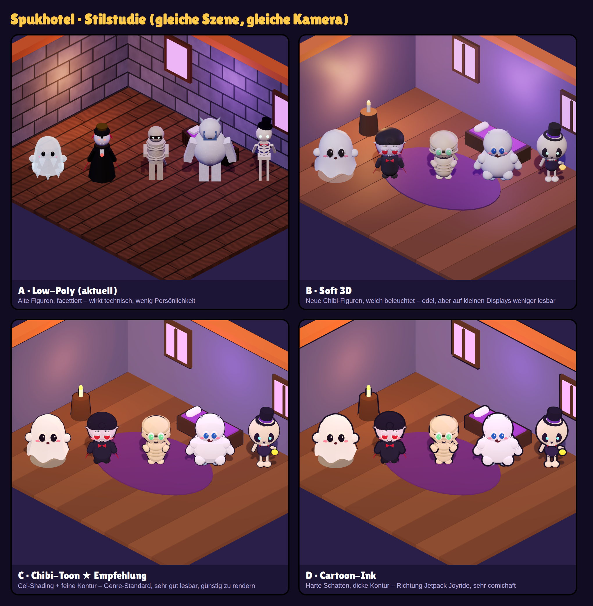
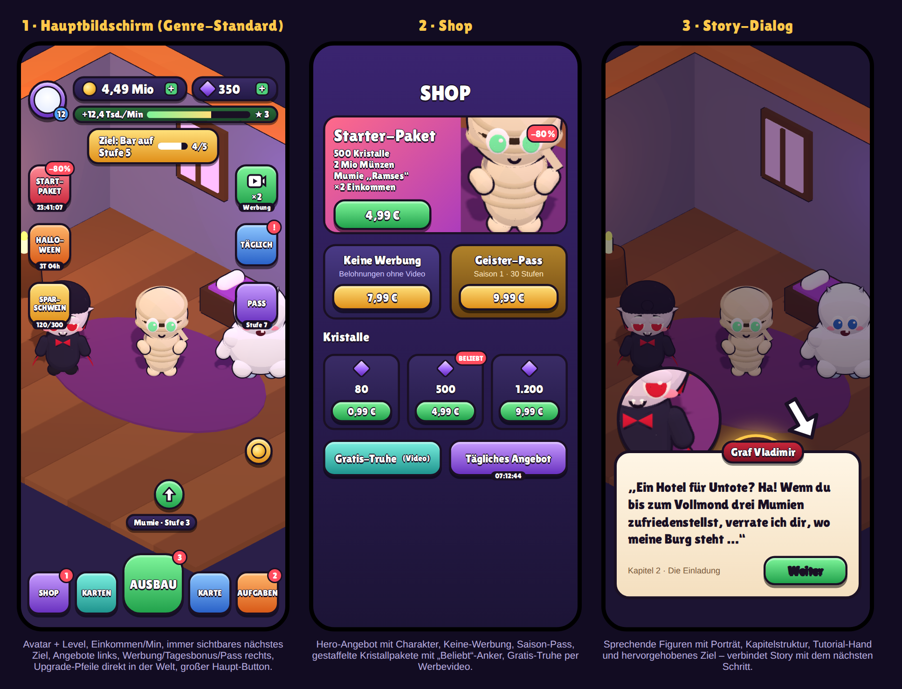

# Spukhotel – Stilstudie & Marktanalyse

Ziel: ein Idle-Tycoon, der sich mit den Titeln großer Studios messen kann
(Idle Miner Tycoon, Eatventure, My Perfect Hotel, Hotel Empire Tycoon, Tavern Master).

## 1. Stilstudie

Gleiche Szene, gleiche Kamera, vier Render-Stile. Die Szene läuft live unter
`/stylelab?style=lowpoly|soft|toon|ink` (Entwickler-Route, nicht im Spiel verlinkt).

| Stil | Wirkung | Lesbarkeit auf dem Handy | Aufwand/Performance |
| --- | --- | --- | --- |
| A · Low-Poly (aktuell) | technisch, kühl, Figuren ohne Persönlichkeit | mittel | niedrig |
| B · Soft 3D | edel, „Pixar/Clay“ | mittel – Figuren verschwimmen mit dem Raum | hoch (PBR, Schatten) |
| **C · Chibi-Toon** | freundlich, markentauglich, Genre-Standard | **sehr gut** – Kontur trennt Figur vom Hintergrund | **niedrig** (Toon-Material) |
| D · Cartoon-Ink | comichaft, laut, Richtung Jetpack Joyride | sehr gut | niedrig |

**Empfehlung: C · Chibi-Toon.** Liegt zwischen Low-Poly und Jetpack-Cartoon, ist der
visuelle Standard der erfolgreichsten Hotel-/Restaurant-Idle-Games und läuft auch auf
schwachen Handys flüssig (keine teuren Lichtberechnungen nötig).

### Was am Charakterdesign fehlte (und in der Studie gelöst ist)

- **Proportionen:** Kopf ≈ ½ Körperhöhe (Chibi) statt realistischer Körper → wirkt niedlich, bleibt klein lesbar.
- **Augen sind alles:** großes Weiß, farbige Iris, Pupille, zwei Glanzpunkte – vorher schwarze Punkte.
- **Silhouette zuerst:** jede Figur hat ein unverwechselbares Merkmal (Vampirkragen, Mumienbinde, Yeti-Hörner, Zylinder).
- **Kontur:** dünne dunkle Outline trennt Figuren vom Raum – der größte Einzelgewinn für die Lesbarkeit.
- **Emotion:** Rouge, Mund, Augenbrauen – Figuren reagieren (später: Freude beim Bezahlen, Ärger beim Warten).

## 2. Layout-Mockups

Unser aktuelles HUD zeigt Zahlen und Menüs – erfolgreiche Idle-Games zeigen **Ziele und Angebote**:

| Element | Aktuell | Genre-Standard |
| --- | --- | --- |
| Spieler-Identität | – | Avatar + Level-Badge oben links |
| Einkommen | nur Kontostand | **Einkommen/Min** + Fortschrittsbalken |
| Nächstes Ziel | versteckt in Menüs | **immer sichtbares Ziel-Banner** |
| Angebote/Events | – | linke Icon-Spalte mit Timer (Starter-Paket, Event, Sparschwein) |
| Werbung/Tagesbonus | – | rechte Icon-Spalte (×2-Video, täglich, Pass) |
| Upgrades | nur im Menü | **Pfeil-Buttons direkt über Zimmern/Figuren** |
| Hauptnavigation | 5 gleich große Knöpfe | großer Haupt-Button in der Mitte („Ausbau“) |
| Story | – | Dialog mit Porträt, Kapitel, Tutorial-Hand |

## 3. Was dem Spiel zum „Studio-Niveau“ fehlt

### Monetarisierung (Umsatz-Grundlage)
| Baustein | Status | Hinweis |
| --- | --- | --- |
| Belohnte Werbevideos (×2 Einkommen, Truhe, Offline ×2, Timer überspringen) | fehlt | größter Umsatz bei Nicht-Zahlern; `react-native-google-mobile-ads` + Mediation (AppLovin MAX/ironSource) |
| Interstitials | fehlt | sparsam, erst nach Minute 10+, nie im Tutorial |
| In-App-Käufe | fehlt | Kristallpakete, Starter-Paket, „Keine Werbung“, dauerhafte Multiplikatoren; `react-native-purchases` (RevenueCat) |
| Saison-/Geister-Pass | fehlt | Gratis- und Premium-Spur, 30 Stufen, 4–6 Wochen |
| Zeitlich begrenzte Angebote, Sparschwein, VIP-Abo | fehlt | Live-Ops-Hebel |

**Technische Voraussetzung:** Werbung und Käufe funktionieren **nicht in Expo Go** – nötig ist ein
Development Build (EAS Build) plus Konten bei Google Play Console, App Store Connect, AdMob und RevenueCat.

### Spieltiefe & Motivation
- **Karten/Manager mit Seltenheit** (gewöhnlich → legendär), die Stationen boosten – Kern-Meta bei Idle Miner und Eatventure.
- **Prestige** („Hotelkette ins Jenseits verkaufen“) für dauerhafte Multiplikatoren – Langzeitmotivation.
- **Level-/Stadtstruktur**: jedes Hotel hat ein klares Ende (alle Ziele erreicht → nächstes Hotel), wie Eatventure.
- **Events** (Halloween, Vollmond) mit eigener Karte, eigener Währung und Ranglisten.
- **Tägliche Belohnungen**, Login-Serien, Erfolge, Sammelalbum der Gäste.
- **Große-Zahlen-Notation** (K, M, B, aa, ab …) – für Spätspiel nötig.

### Story-Einbindung
- Erzählfigur (z. B. Hotel-Erbin „Oma Grusella“) führt durch Tutorial und Kapitel.
- Jedes Hotel = Kapitel mit Intro-Comic (3–4 Bilder), Dialogen beim Freischalten, Abschluss-Szene.
- Wiederkehrende Stammgäste mit Mini-Geschichten („Der Graf sucht seinen Sarg“) als Aufträge.

### Präsentation & Spielgefühl („Juice“)
- Münzen fliegen sichtbar zum Zähler, Zahlen-Popups über Figuren, Level-up-Banner, Konfetti.
- Sound & Musik je Hotel, Haptik bei Taps.
- Figuren-Animationen: Laufen, Winken, Schlafen, Freude/Ärger-Emotes.
- Kamera-Fahrten beim Freischalten neuer Bereiche.
- Tutorial mit Zeigehand statt Textbox.

### Technik & Betrieb
- Analytics (Firebase/GameAnalytics): Funnel, Retention D1/D7/D30, ARPDAU.
- Remote Config + A/B-Tests für Preise und Balancing.
- Cloud-Speicherstand (Konto-Login), serverseitige Kaufprüfung.
- Push-Benachrichtigungen („Deine Grüfte sind voll – Einnahmen abholen“).
- Absturz-Reporting (Sentry), Performance-Tests auf Mittelklasse-Android.

### Recht (DE/EU)
- Datenschutzerklärung, Impressum, DSGVO-Einwilligung für Werbung (Google UMP), iOS-ATT-Abfrage.
- Altersfreigabe über IARC/USK; Zufallsbelohnungen gegen Echtgeld transparent machen (Wahrscheinlichkeiten anzeigen).
- Preise inkl. MwSt., Widerrufsbelehrung für digitale Inhalte.

## 4. Vorgeschlagene Reihenfolge

1. **Art-Direction festlegen** (Stil C) → alle Gäste/Personal/Räume auf Chibi-Toon umstellen.
2. **HUD nach Mockup 1** umbauen (Ziel-Banner, Seitenleisten, In-World-Upgrades).
3. **FTUE/Tutorial + Story Kapitel 1** (erste 10 Minuten entscheiden über Retention).
4. **Development Build (EAS)**, dann belohnte Werbung + IAP-Grundgerüst (Testmodus).
5. **Karten/Manager-System** + Prestige.
6. Analytics, Remote Config, Cloud-Save.
7. Events + Saison-Pass (Live-Ops).
8. Sound, Juice, Soft-Launch in einem Testmarkt, KPIs messen, dann globaler Launch.
